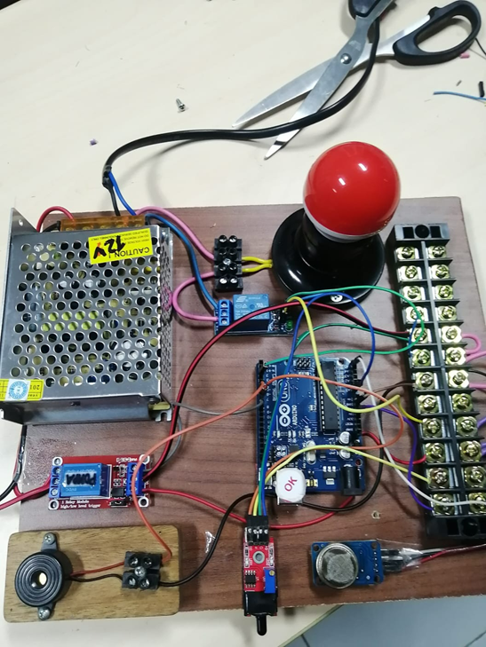
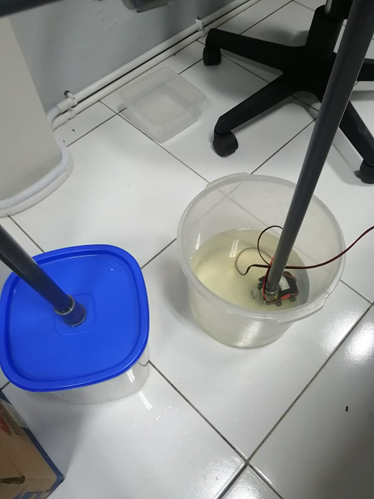

# Sistem Pendeteksi Kebakaran
Proyek ini adalah sistem pendeteksi kebakaran yang menggunakan sensor api dan asap untuk mendeteksi adanya kebakaran. Ketika kebakaran terdeteksi, sistem akan mengaktifkan alarm dan pompa air, serta menyalakan lampu indikator.

## Alat yang Digunakan

- 🖥️ Arduino UNO
- 🌫️ Sensor Asap MQ2
- 🔥 Sensor Api
- 🔊 Buzzer
- 🔌 Relay
- 💧 Pompa Air
- 💡 Lampu Indikator

## Gambar Proyek

